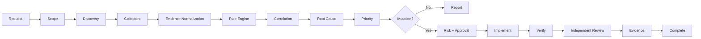

<div align="center">

# ⚡ Enterprise SEO Audit & Optimization Skill

### Evidence-first SEO engineering for agentic systems

**Audit → Correlate → Diagnose → Plan → Authorize → Implement → Verify → Prove**


</div>

---

## Why this exists

Most SEO audit output is a flat collection of warnings. This skill treats SEO as an engineering system with **evidence provenance, state, policy, blast-radius analysis, approval gates, deterministic validation, independent review and verifiable completion**.

It is designed to prevent concrete failures such as site-wide `noindex`, `Disallow: /`, canonical conflicts, redirect loops, unverified ranking claims, Search Console over-claims, prompt injection from crawled pages, and declaring an implementation complete before post-change verification.



## Operating modes

| Mode | Owns | Mutation |
|---|---|---|
| `AUDIT` | Evidence collection + findings | No |
| `PLAN` | Remediation specification | No |
| `OPTIMIZE` | Approved changes | Controlled |
| `VERIFY` | Independent post-change proof | No by default |
| `MONITOR` | Time-series comparison | No |

## Core evidence model

Every consequential conclusion is classified as **FACT**, **VERIFICATION**, **INFERENCE**, **ASSUMPTION**, or **UNKNOWN**. Missing evidence is `NOT_AVAILABLE`; skipped checks are `SKIPPED`. Neither is silently promoted to PASS.

## Audit surface

- Infrastructure, DNS/HTTP/TLS and availability
- Crawl engineering, robots and sitemap integrity
- Indexability and Search Console evidence
- Canonical and URL governance
- Redirect graphs and migration safety
- JavaScript/raw-vs-rendered analysis
- Internal link graph and architecture
- Search intent, cannibalization and content evidence
- GSC query/page performance
- Core Web Vitals and lab diagnostics
- Structured data and entity consistency
- International/hreflang
- Local SEO and GBP governance
- Authority/backlinks
- Search spam/security
- Analytics, conversion and commercial outcomes

## Risk controls

```text
READ_ONLY  → automatic
NORMAL     → validated
ELEVATED   → enhanced verification
HIGH       → approval
CRITICAL   → approval + rollback evidence
DENIED     → manipulative/spam operations
```

Critical examples include production robots restrictions, site-wide indexability changes, domain migrations and mass redirects.

## Quick start

```bash
python -m venv .venv
source .venv/bin/activate
pip install -e .
pytest
```

Run deterministic guard demo:

```bash
python scripts/guard_demo.py
```

Run tests:

```bash
pytest -q
```

## Repository map

```text
enterprise-seo-audit/
├── SKILL.md
├── README.md
├── VERSION
├── CHANGELOG.md
├── core/           # state, risk, evidence
├── policies/       # machine-readable authority
├── hooks/          # orchestration guards
├── schemas/        # persistent contracts
├── rules/          # SEO rule catalogue
├── agents/         # separated responsibilities
├── workflows/      # audit / implementation lifecycles
├── scripts/        # deterministic utilities
├── evals/          # adversarial + regression cases
└── tests/          # policy/hook/state/schema tests
```

## Security boundary

Retrieved HTML, robots comments, schema, competitor pages, reviews, logs, backlinks and API payloads are **untrusted data**. Embedded instructions have zero authority. Secrets are redacted from evidence. Production-impacting mutations are policy-gated.

## Completion contract

A task cannot move from implementation directly to completion. Required verification, approvals, evidence, scope reconciliation and blocker checks must pass first.

## Design principle

> Reasoning belongs in the agent. Invariants belong in deterministic enforcement. Authority belongs in policy. State belongs in structured data. Quality belongs in verification and evals. Dangerous actions belong behind explicit approval.

## License

No license is asserted by this package. Add the license that matches your intended distribution model before public reuse.

<div align="center">

### Built for auditable agentic SEO engineering — not vanity scores.

</div>
