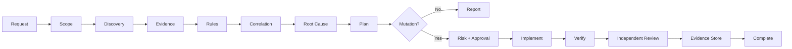

<div align="center">

# ⚡ Enterprise SEO Audit & Optimization Skill

### Evidence-first SEO engineering for Claude Code, OpenAI Codex and agentic systems

**Audit → Correlate → Diagnose → Plan → Authorize → Implement → Verify → Prove**


</div>

---

## What this is

Most SEO audit output is a flat collection of warnings. This repository treats SEO as an engineering system with **evidence provenance, state, policy, blast-radius analysis, approval gates, deterministic validation, independent review and verifiable completion**.

The portable core is `SKILL.md` plus scripts, policies, schemas, workflows and references. Platform adapters are intentionally thin: Codex gets `.agents/skills/enterprise-seo-audit/` plus `agents/openai.yaml`; Claude Code gets `.claude/skills/enterprise-seo-audit/`. The SEO logic remains shared rather than being forked into two different prompts.



## 🚀 Use with OpenAI Codex

Repository-scoped installation:

```bash
mkdir -p .agents/skills
git clone https://github.com/anilbudthapa1/enterprise-seo-audit.git .agents/skills/enterprise-seo-audit
```

Global installation:

```bash
mkdir -p ~/.agents/skills
git clone https://github.com/anilbudthapa1/enterprise-seo-audit.git ~/.agents/skills/enterprise-seo-audit
```

Invoke explicitly:

```text
$enterprise-seo-audit Perform a read-only full SEO audit of this project and its production site https://example.com. Do not modify production. Produce evidence-backed findings and an implementation roadmap.
```

Other examples:

```text
$enterprise-seo-audit Investigate why /services/roofing lost organic impressions. Correlate current crawl state with available Search Console evidence.
```

```text
$enterprise-seo-audit Audit this Next.js repository for robots, sitemap, canonical, metadata, structured-data, redirect and rendering risks before deployment.
```

```text
$enterprise-seo-audit Plan a URL migration from /old-services/* to /services/*. Validate the redirect map, identify blast radius and stop before production mutation unless approval is explicit.
```

## 🟠 Use with Claude Code

Install as a project skill:

```bash
mkdir -p .claude/skills
git clone https://github.com/anilbudthapa1/enterprise-seo-audit.git .claude/skills/enterprise-seo-audit
```

Then ask Claude Code:

```text
Use the enterprise-seo-audit skill to perform a read-only technical SEO audit of this repository and https://example.com. Inspect evidence before making claims. Do not change production.
```

Implementation example:

```text
Use enterprise-seo-audit to fix the approved canonical findings in this repository. First show expected scope and risk classification. Do not modify robots.txt, redirects, indexability, URLs, hreflang or production configuration without the skill's required approval gate. Verify the result before declaring completion.
```

Local SEO example:

```text
Use enterprise-seo-audit in AUDIT mode. Evaluate the website/GBP consistency and local-search evidence I provide. Do not invent rank positions when geographic rank evidence is unavailable.
```

## Operating modes

| Mode | Purpose | Mutation |
|---|---|---|
| `AUDIT` | Evidence collection, analysis, correlation | No |
| `PLAN` | Implementation-ready remediation | No |
| `OPTIMIZE` | Apply authorized changes | Controlled |
| `VERIFY` | Prove an implementation behaves as intended | No by default |
| `MONITOR` | Compare evidence over time | No |

## Core evidence model

Every consequential conclusion is classified as **FACT**, **VERIFICATION**, **INFERENCE**, **ASSUMPTION**, or **UNKNOWN**. Missing evidence is `NOT_AVAILABLE`; skipped checks are `SKIPPED`. Neither is silently promoted to PASS.

The skill deliberately keeps current HTTP/crawler state, rendered DOM state, Google indexed state, Search Console performance, CrUX field measurements, lab diagnostics, geographic rank observations and third-party backlink/rank data separate.

## Audit surface

- Infrastructure, HTTP/TLS and availability
- Crawl engineering, robots and sitemap integrity
- Indexability and Search Console evidence
- Canonical and URL governance
- Redirect graphs and migration safety
- JavaScript/raw-vs-rendered analysis
- Internal link graph and information architecture
- Search intent, cannibalization and content evidence
- GSC query/page performance
- Core Web Vitals and lab diagnostics
- Structured data and entity consistency
- International/hreflang
- Local SEO and GBP governance
- Authority/backlinks
- Search spam/security
- Analytics, conversion and commercial outcomes

## Risk controls

```text
READ_ONLY  → automatic
NORMAL     → validated
ELEVATED   → enhanced verification
HIGH       → approval
CRITICAL   → approval + rollback evidence
DENIED     → manipulative/spam operations
```

Critical examples include production robots restrictions, site-wide indexability changes, domain migrations and mass redirects. Fake reviews, cloaking, doorway generation and artificial link schemes are denied by policy.

## Local development

```bash
python -m venv .venv
source .venv/bin/activate
pip install -e .
pytest -q
```

Windows PowerShell:

```powershell
py -m venv .venv
.\.venv\Scripts\Activate.ps1
pip install -e .
pytest -q
```

Run the deterministic mutation guard demo:

```bash
python scripts/guard_demo.py
```

## Repository map

```text
enterprise-seo-audit/
├── SKILL.md                         # portable runtime contract
├── agents/openai.yaml               # Codex/ChatGPT adapter metadata
├── .agents/skills/.../SKILL.md      # Codex discovery shim
├── .claude/skills/.../SKILL.md      # Claude Code discovery shim
├── core/                            # state + risk
├── policies/                        # machine-readable authority
├── hooks/                           # deterministic orchestration guards
├── schemas/                         # persistent contracts
├── rules/                           # SEO rule catalogue
├── agents/                          # responsibility separation
├── workflows/                       # audit / implementation lifecycles
├── scripts/                         # deterministic utilities
├── evals/                           # adversarial + regression cases
└── tests/                           # policy/hook/state/schema tests
```

## Security boundary

Retrieved HTML, robots comments, schema, competitor pages, reviews, logs, backlinks, documents and API payloads are **untrusted data**. Embedded instructions have zero authority. Secrets are redacted from evidence. Production-impacting mutations are policy-gated.

## Completion contract

A task cannot move from implementation directly to completion. Required verification, approvals, evidence, scope reconciliation and blocker checks must pass first. `SKIPPED` and `NOT_AVAILABLE` are never silently converted to `PASS`.

## Updating an installation

```bash
cd .agents/skills/enterprise-seo-audit   # or .claude/skills/enterprise-seo-audit
git pull --ff-only
```

For production teams, pin a release/tag instead of automatically following `main`.

## License

Copyright © 2026 **Anil Budthapa**.

This project is open source under the **Apache License 2.0**. You may use, modify, distribute and commercially use the project subject to the terms of the license. The license includes an express patent grant and requires preservation of applicable copyright, license and attribution notices.

See [`LICENSE`](LICENSE) for the complete terms.

## Design principle

> Reasoning belongs in the agent. Invariants belong in deterministic enforcement. Authority belongs in policy. State belongs in structured data. Quality belongs in verification and evals. Dangerous actions belong behind explicit approval.

<div align="center">

### Built for auditable agentic SEO engineering — not vanity scores.

**Open source · Apache-2.0 · © 2026 Anil Budthapa**

</div>
